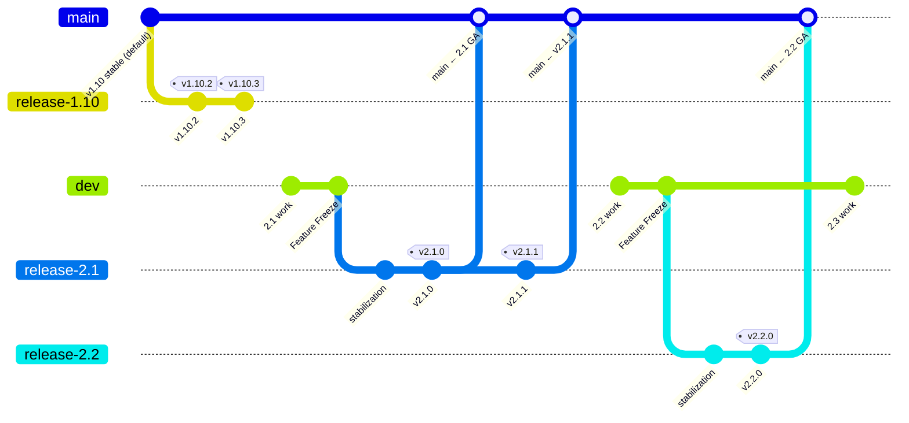
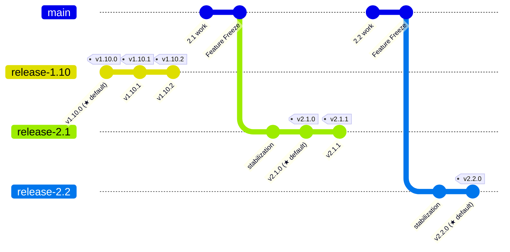
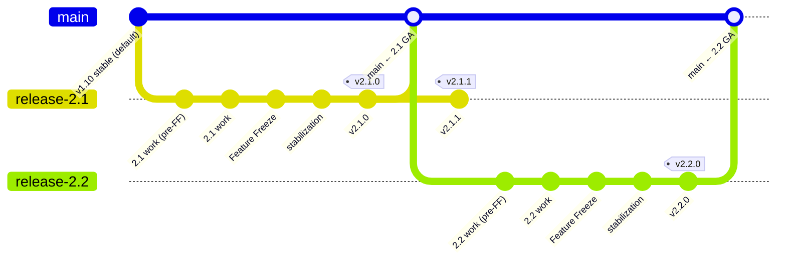
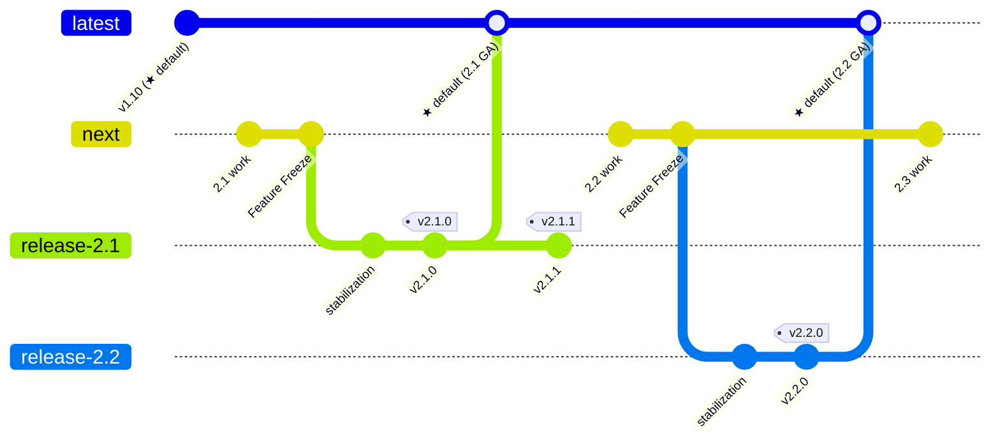

# ADR: Branching Strategy for rhdh-local Development

## Context

**Problem**: Development work for upcoming RHDH releases cannot land in the [rhdh-local](https://github.com/redhat-developer/rhdh-local) repository because the default branch (`main`) must remain stable and compatible with the current GA release of RHDH.

RHDH Local is a flagship tool for testing RHDH locally using Podman or Docker without any dependency on a Kubernetes or OpenShift cluster. PMs [require](https://redhat-internal.slack.com/archives/C07EVRDD7KN/p1781509617319969?thread_ts=1781266325.167119&cid=C07EVRDD7KN) that `main` always provides a "clone and run" experience: users run `git clone` followed by `podman compose up` (or `docker compose up`) and immediately get a working RHDH instance against the latest stable GA release (currently 1.10). And existing users who already cloned `main` just `pull` the latest changes in order to upgrade.

The problem surfaces whenever contributors need to merge work targeting an upcoming release. For example, [PR #256](https://github.com/redhat-developer/rhdh-local/pull/256) is a 2.1 feature switching dynamic plugin toggling from a `disabled` field to a new `enabled` field. The PR cannot be merged because `main` is pinned to RHDH 1.10. This is not a one-time issue: even minor releases have caused friction in the past (e.g., adding a new harmless `CATALOG_INDEX_IMAGE` env var to `default.env` for 1.9 while `main` was still on 1.8 was considered confusing).

The current release process creates `release-x.y` branches at Feature Freeze, then tags those branches at GA and for each patch release (`x.y.z`). However, there is no landing zone for pre-Feature-Freeze development work targeting the next release. PRs sit open, accumulate conflicts, and slow down the team.

## Decision

Introduce a long-lived `dev` branch in `rhdh-local` as the development branch for the upcoming RHDH release. `main` remains the default branch and continues to track the latest stable GA release of RHDH.

**Implementation approach**:
- Create a `dev` branch off `main`. All PRs targeting the next RHDH release are merged into `dev`
- `main` remains the default (and stable) branch; existing users who have cloned the repo are unaffected
- `dev` is configured for the RHDH `next` tag (the development build for the upcoming release), while `main` remains configured for the current GA RHDH version
- `dev` is always exactly one release ahead of `main`; work targeting releases beyond the immediate next one should not land on `dev`
- At Feature Freeze, the RHDH productization team's release branch creation scripts create `release-x.y` from `dev` (not `main`). The tag creation scripts continue to tag from `release-x.y` at GA and for each patch release
- At GA, the `release-x.y` branch corresponding to the latest stable RHDH release is merged into `main`. `dev` continues as usual; no rebase or reset is needed
- Update the contribution guide to document that PRs should target `dev` for release-specific work, or `main` for version-independent changes (e.g., documentation fixes, GitHub Actions dependency updates)
- Configure branch protection on `dev` with the same review requirements as `main`

**Cherry-pick policy**:
- Version-independent changes (documentation, GitHub Actions dependency updates) can target `main` directly or be cherry-picked between `dev` and `main`
- RHDH-specific or configuration changes remain on `dev` until the corresponding RHDH version is GA and the `release-x.y` branch is merged into `main`
- Fixes to `release-x.y` branches should be cherry-picked to both `main` and `dev`

## Alternatives considered

### Alternative 1: Rotate default branch to `release-x.y` at each GA

- **Approach**: Make the `release-x.y` branch the GitHub default branch every time a new RHDH version reaches GA. `main` would effectively become the development branch

- **Rejected because**: Changing the GitHub default branch alone does not affect existing clones; they still track `origin/main`. However, for this approach to unblock development, `main` would need to accept unstable next-release work, and existing users pulling `main` would start receiving unstable content. This contradicts the PM requirement that the branch users have cloned must remain stable

### Alternative 2: Create `release-x.y` early (before Feature Freeze)

- **Approach**: Create `release-2.1` now and direct all 2.1 work to target that branch instead of `main`. The release branch would serve double duty as both the development and release branch

- **Rejected because**: This conflates development and release stabilization concerns. The release branch is intended for stabilization between Feature Freeze and GA (e.g., RHDH test day fixes). Using it for active feature development dilutes its purpose and makes it harder to distinguish pre-FF development commits from post-FF stabilization fixes

### Alternative 3: Rename branches to `latest`/`next` scheme

- **Approach**: Create a rolling `latest` branch as the default (always pointing to the latest stable GA), rename `main` to `next` (tracking the unstable upcoming release). At each GA, `latest` advances to the new stable version, and `next` resets to the following unreleased version. Older supported streams would have `release-x.y` branches

- **Rejected because**: Renaming `main` breaks existing clones just like Alternative 1. The added naming complexity (three branch naming conventions: `latest`, `next`, `release-x.y`) increases cognitive load for contributors without proportional benefit. The scheme also introduces complexity around when to create `release-x.y` branches for older streams; e.g., `release-2.1` would only be created at 2.2 GA time, creating a gap in the maintenance model

## Consequences

### Positive
- ✅ Existing users are unaffected; `main` remains the stable default branch with no disruption to "clone and run" workflows
- ✅ Immediate unblocking of next-release development; PRs like #256 can be merged into `dev` and validated against the correct RHDH version
- ✅ Clean separation between stable content (`main`), active development (`dev`), and release stabilization (`release-x.y`)
- ✅ The `dev` branch serves as an integration point where next-release features can be tested together before Feature Freeze, rather than sitting in isolated open PRs
- ✅ Minimal conceptual overhead; the `main`/`dev` pattern is widely understood across the industry

### Negative
- ❌ Contributors must learn to target `dev` instead of `main` for next-release work; risk of PRs accidentally targeting the wrong branch until the team adjusts
- ❌ Two long-lived branches (`main` + `dev`) require periodic synchronization, adding maintenance overhead
- ❌ The RHDH productization team must update Feature Freeze scripts to branch `release-x.y` from `dev` rather than `main`
- ❌ `dev` and `main` can diverge over a release cycle, making cherry-picks in either direction progressively harder and potentially causing non-trivial merge conflicts when `release-x.y` is merged into `main` at GA

### Neutral
- ⚖️ Branch protection rules need to be configured for both `main` and `dev`
- ⚖️ This decision is scoped to `rhdh-local`

